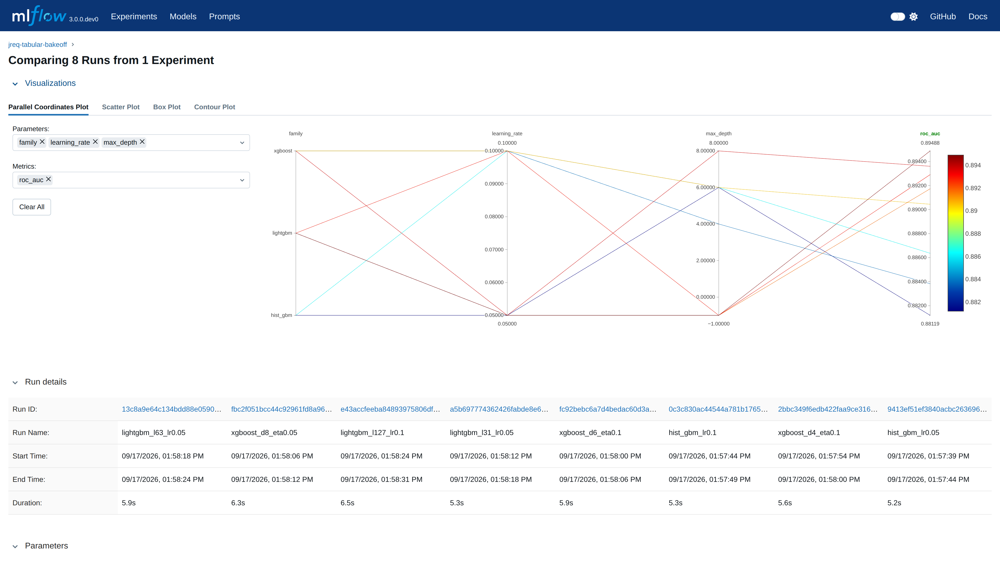

# MLflow on AWS, end to end

Provisions a managed MLflow tracking server in your AWS account, logs two
real bake-offs into it, screenshots the UI showing runs and model comparison,
writes a report, and tears the whole thing down again. One command per phase,
nothing manual, repeatable on demand.

The point is not the models. The point is that "do you have MLflow running,
with output comparing models" has a reproducible answer that takes about an
hour and a dollar to regenerate from scratch.

> **[Read the results →](RESULTS.md)** — both bake-off tables, the twelve UI
> screen grabs, measured cost, the seven things that broke on the way, and
> primary-source citations for every figure.

## What the output looks like

Eight of fourteen candidates compared in one view — model family, learning rate and
tree depth on the left axes, held-out ROC AUC on the right, one line per run:



Captured headlessly against the live server by `capture/shoot.py`, which resolves the
ids of the runs that were just logged, mints a presigned UI URL, and drives each of the
twelve views in [`capture/shots.yaml`](capture/shots.yaml). Nine are required-to-render:
if one comes back empty or suspiciously small, the capture step fails and names it.

`make shots-dry` prints the resolved URL for every shot without opening a browser —
[`capture/example-dry-run.txt`](capture/example-dry-run.txt) is real output from a live
server. Note it currently needs the server running, since it resolves run ids from
MLflow; it is not usable to preview the plan before provisioning.

The other eleven are in [`artifacts/screenshots/`](artifacts/screenshots/), with
[`contact-sheet.png`](artifacts/contact-sheet.png) showing all of them at once.

## What gets built

| | |
|---|---|
| Tracking server | `aws_sagemaker_mlflow_tracking_server`, size `Small`, MLflow 3.x |
| Artifact store | S3 bucket, versioned, SSE-S3, public access blocked, 30-day expiry |
| IAM | One role for the server, scoped to that bucket and nothing else |
| Region | `us-east-2` (account `<account>`) |
| Cost | $0.60/hr while running, $0 while stopped (us-east-2). A full up→capture→down pass is about **$1** |

Everything carries `Project=jreq-mlflow` and `Ephemeral=true`. Teardown filters
on those tags and will not touch anything else in the account.

## Phases

```bash
make check                      # read-only: identity, permissions, cost. Creates nothing.
make up EXECUTE=--execute       # terraform apply + wait for Created (~25 min)
make seed                       # both bake-offs
make shots                      # screenshot the MLflow UI
make report                     # artifacts/REPORT.md
make down                       # stop the server: billing ends, runs kept
make destroy EXECUTE=--execute  # sync artifacts down, then remove everything
```

`make all EXECUTE=--execute` chains up → seed → shots → report.
`make e2e EXECUTE=--execute` runs the same cycle through Ansible, which is the
form to use from CI.

Anything that creates or deletes AWS resources refuses to run without
`EXECUTE=--execute`. A missing prerequisite fails as `CONFIG_REQUIRED`; it never
degrades into a silent skip.

## The two experiments

**`jreq-tabular-bakeoff`** — 14 candidates across six model families
(baseline, logistic regression, random forest, hist gradient boosting, XGBoost,
LightGBM) on one reproducible dataset. Every run logs the same parameter
vocabulary, sentinel-filled where a knob does not apply, which is what keeps
MLflow's parallel-coordinates plot dense instead of full of gaps. Metrics:
ROC AUC, average precision, F1, precision, recall, accuracy, log loss, Brier,
fit seconds, predict ms/1k, model size. Artifacts: ROC curve, PR curve,
confusion matrix, feature importance, a prediction sample. The best run by
held-out ROC AUC is registered as `jreq-tabular` and given the `champion` alias.

The default dataset is synthetic (`make_classification`, imbalanced, with label
noise) so the run is bit-for-bit reproducible offline and the models actually
separate. `--dataset breast_cancer` uses the bundled real one instead. The
generation parameters are logged as an artifact on every run, so nothing about
its provenance is hidden.

**`jreq-router-bakeoff`** — each model called directly, plus three routing
policies (`cheap-first`, `balanced`, `quality-first`) that pick a model per
request from a difficulty heuristic, all scored over the same fixed 25-prompt
set with deterministic exact-match grading. Metrics: quality overall and on the
hard subset, p50/p95/mean latency, tokens/sec, token counts, USD per 1k
requests, error rate.

Backends: real Bedrock Converse calls when the account has model access,
otherwise a deterministic local simulator. **Every simulated run is tagged
`simulated=true` and the report says so**, so a screenshot of a mock run can
never be passed off as a measurement of real endpoints.

## The screenshots

`capture/shots.yaml` lists twelve views — experiments list, runs tables,
compare-runs parallel coordinates and scatter, metric charts, a run detail page,
logged artifacts, the model registry, the registered champion version, and the
router cost/quality frontier. `capture/shoot.py` resolves the ids of the runs
that were just logged, mints a presigned UI URL, and drives headless chromium
through each one at 2x scale.

Nine of the twelve are marked `required: true`. If a required view fails to
render — or renders suspiciously small, which is what an empty state looks
like — the capture step exits non-zero and names it. `artifacts/screenshots/manifest.json`
records what was captured and what was not.

`make shots-dry` prints the resolved URLs without opening a browser.

## Report

`artifacts/REPORT.md` carries the account, region and server identity, both
comparison tables, the registry state, and the screenshots inline.
`artifacts/comparison.csv` is the same data straight out of `mlflow.search_runs`
— so the numbers in the report, the numbers in the CSV and the numbers in the UI
are one query, not three retypings of it.

## Layout

```
terraform/    infrastructure
ansible/      end-to-end orchestration, one role per phase
experiments/  the two bake-offs and their shared MLflow wiring
capture/      the screenshot plan and its Playwright driver
bin/          preflight check and report renderer
artifacts/    generated evidence (gitignored)
```
